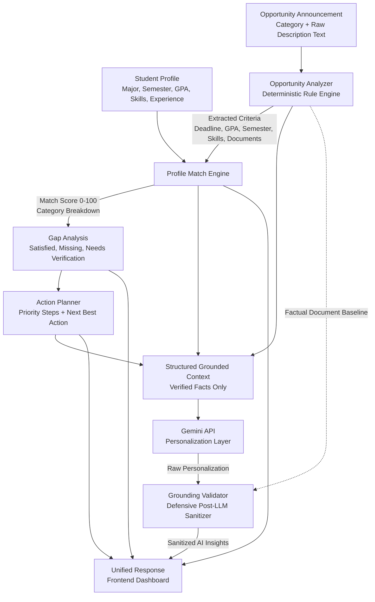

# SkillBridge AI

> **From Opportunity to Action.**

[](https://github.com/bioonahnuu-design)
[](https://react.dev/)
[](https://vitejs.dev/)
[](https://fastapi.tiangolo.com/)
[](https://www.python.org/)
[](https://ai.google.dev/)
[](https://vercel.com/)

---

## About SkillBridge AI

**SkillBridge AI** is an intelligent academic and career preparation platform designed to help university students bridge the gap between unstructured opportunity announcements and concrete, actionable preparation steps.

Students frequently discover valuable scholarships, internships, student exchanges, competitions, and development programs, but often struggle to assess whether their current academic profile matches the opportunity's strict eligibility criteria. SkillBridge AI eliminates this friction by deterministically extracting requirements, computing an exact profile match score, highlighting critical gaps, generating a prioritized action roadmap, and delivering safe, grounded AI-guided personalization.

---

## The Problem

Every academic cycle, students encounter hundreds of opportunity announcements across universities, portals, and social media. However, students face persistent obstacles:

1. **Ambiguous Criteria & Fine Print**: Complex announcement texts bury critical constraints (minimum GPA, eligible semester brackets, specific prerequisite skills, and exact required documents).
2. **Readiness Uncertainty**: Students cannot easily tell if their background actually fits the criteria before investing hours into an application.
3. **Hidden Application Gaps**: Identifying missing coursework, language certifications, or recommendation letters usually happens too late in the process.
4. **Lack of Clear Next Steps**: Even when students know their shortcomings, they lack a structured timeline or prioritization strategy to address them before the deadline.

---

## Our Solution

SkillBridge AI transforms passive reading into active, structured preparation through a seamless 5-stage pipeline:

1. **Intelligent Opportunity Ingestion**: Students paste an announcement text and select the opportunity category.
2. **Deterministic Information Extraction**: The backend extracts deadlines, GPA thresholds, semester requirements, technical/soft skills, documents, benefits, and eligibility criteria without relying on probabilistic AI.
3. **Quantitative Profile Matching**: The student's academic background (major, semester, GPA, skills, experience) is matched against the criteria, yielding a transparent 0–100 match score with a category-by-category breakdown.
4. **Diagnostic Gap Analysis & Action Roadmap**: Gaps and items requiring verification are converted into a prioritized action plan featuring a single immediate "Next Best Action" and a structured "NOW / NEXT / THEN" timeline.
5. **Grounded AI Personalization**: A safe AI orchestration layer powered by Google Gemini provides encouraging, tailored strategic insights—strictly constrained and defensive-sanitized against deterministic facts.

---

## Key Features

- **Context-Aware Opportunity Analyzer**: Deterministically extracts application deadlines, GPA thresholds, semester requirements, technical and soft skills, required submission documents, and awarded benefits/perks.
- **Weighted Profile Match Engine**: Transparently evaluates candidate fitness across five dimensions (Eligibility, Academic GPA/Semester, Skills, Documents, and Deadlines) to generate an explainable score.
- **Diagnostic Gap Identification**: Highlights satisfied criteria, critical missing requirements, and items needing manual verification (e.g., citizenship or unaccredited experience).
- **Prioritized Action Planner**: Produces high-leverage immediate recommendations ("Next Best Action") alongside chronological roadmap milestones with priority tags and actionable rationales.
- **Multi-Category Support**: Tailored extraction and evaluation logic for six major opportunity types:
  - Scholarship
  - Internship
  - Student Exchange
  - Competition
  - Volunteer Program
  - Skill Course / Training
- **AI-Guided Strategic Insight**: Contextual summary, match explanation, focus areas, recommended strategy, and constructive encouragement powered by Google Gemini.
- **Defensive Anti-Hallucination Grounding**: Post-LLM validation guarantees the AI cannot invent phantom document requirements (e.g., hallucinating CV or transcript requests when the announcement specifies none).

---

## How It Works



---

## AI Grounding Architecture

A core architectural pillar of SkillBridge AI is that **the deterministic engine is the single source of truth**.

Large Language Models (LLMs) often hallucinate common application requirements (such as demanding a CV, academic transcript, or recommendation letter) even when an announcement explicitly requires none. SkillBridge AI enforces strict grounding guardrails:

1. **Pre-LLM Isolation**: The AI does not analyze raw opportunity text directly. Instead, deterministic services extract all factual constraints first.
2. **Structured Context Injection**: The Gemini prompt receives only verified facts (extracted criteria, calculated scores, and real gaps).
3. **Defensive Post-LLM Sanitization**: Before any AI response is returned to the user, `validate_and_sanitize_personalization()` verifies every recommendation against the deterministic `required_documents` list:
   - When no documents are required (`required_documents == []`), any hallucinated document advice is stripped from `focus_areas` and prose fields.
   - Legitimate advice on authorized documents is preserved.
   - Non-document guidance (e.g., technical skill acquisition, mock interview practice) is retained.
4. **Deterministic Resilience**: If the Gemini API key is unconfigured or a network timeout occurs, the core application continues to deliver 100% of deterministic analysis, match scoring, and action planning.

---

## Tech Stack

| Layer          | Technology               | Purpose                                                                 |
| -------------- | ------------------------ | ----------------------------------------------------------------------- |
| **Frontend**   | React 19 + Vite 8        | High-performance Single Page Application with reactive state management |
| **Backend**    | FastAPI + Python 3.10+   | Fast, asynchronous REST API with strict Pydantic v2 data validation     |
| **AI Engine**  | Google Gemini API        | Structured personalization and strategic application guidance           |
| **Validation** | Pydantic v2              | Contract enforcement and type safety across all service boundaries      |
| **Testing**    | Pytest                   | Comprehensive unit, regression, and agent grounding test suites         |
| **Deployment** | Vercel (Vercel Services) | Unified multi-service deployment for frontend and backend               |

---

## Project Structure

```
skillbridge-ai/
├── backend/
│   ├── app/
│   │   ├── agent/
│   │   │   ├── grounding.py      # Defensive anti-hallucination validation
│   │   │   ├── llm.py            # Gemini API integration with graceful fallback
│   │   │   ├── orchestrator.py   # SkillBridgeAgent orchestration pipeline
│   │   │   ├── prompts.py        # Grounded system and user prompt definitions
│   │   │   └── tools.py          # Deterministic tool execution wrappers
│   │   ├── routes/
│   │   │   └── opportunities.py  # REST API endpoints (/api/*)
│   │   ├── services/
│   │   │   ├── analyzer.py       # Deterministic opportunity criteria extractor
│   │   │   ├── matcher.py        # Weighted profile match and gap engine
│   │   │   └── planner.py        # Prioritized action plan generator
│   │   ├── main.py               # FastAPI application setup and CORS
│   │   └── schemas.py            # Pydantic request and response models
│   ├── tests/
│   │   ├── test_agent.py         # AI agent orchestration and grounding tests
│   │   ├── test_analyzer.py      # Opportunity extractor regression tests
│   │   ├── test_matcher.py       # Profile matching and scoring tests
│   │   └── test_planner.py       # Action planner and timeline tests
│   ├── .env.example              # Template for backend environment variables
│   └── requirements.txt          # Python production dependencies
├── frontend/
│   ├── src/
│   │   ├── assets/               # Brand assets and illustrations
│   │   ├── components/           # UI components (Navbar, Forms, Analysis, etc.)
│   │   ├── pages/
│   │   │   └── Dashboard.jsx     # Main interactive student workspace
│   │   ├── services/
│   │   │   └── api.js            # Unified API client using relative routing
│   │   ├── App.jsx               # Application entrypoint
│   │   ├── index.css             # Design system and typography styles
│   │   └── main.jsx              # React DOM initialization
│   ├── package.json              # Frontend scripts and dependencies
│   └── vite.config.js            # Vite build configuration and proxy setup
├── vercel.json                   # Vercel Services multi-project configuration
└── README.md                     # Project documentation
```

---

## API Endpoints

All endpoints are served with the `/api` prefix:

| Method | Endpoint             | Description                                                                 |
| ------ | -------------------- | --------------------------------------------------------------------------- |
| `GET`  | `/health`            | Service health check and uptime status                                      |
| `POST` | `/api/analyze`       | Deterministic extraction of requirements, GPA, skills, and documents        |
| `POST` | `/api/match`         | Evaluates student profile against opportunity; returns match score and gaps |
| `POST` | `/api/plan`          | Generates prioritized action items and verification checklist               |
| `POST` | `/api/agent/analyze` | Full orchestration pipeline: Analyzer → Matcher → Planner → Grounded AI     |

---

## Running Locally

### Prerequisites

- **Python**: 3.10 or higher
- **Node.js**: 18.0 or higher
- **npm**: 9.0 or higher

### 1. Backend Setup

```bash
# Navigate to backend directory
cd backend

# Create and activate virtual environment
python -m venv .venv

# Windows (Command Prompt / PowerShell):
.venv\Scripts\activate

# macOS / Linux:
source .venv/bin/activate

# Install dependencies
pip install -r requirements.txt

# (Optional) Configure Gemini API key in .env
copy .env.example .env

# Run FastAPI backend with hot reload
python -m uvicorn app.main:app --reload --port 8000
```

The backend API documentation will be available at `http://localhost:8000/docs`.

### 2. Frontend Setup

In a separate terminal:

```bash
# Navigate to frontend directory
cd frontend

# Install dependencies
npm install

# Start Vite development server
npm run dev
```

Open `http://localhost:5173` in your browser.

---

## Environment Variables

### Backend (`backend/.env`)

| Variable         | Required | Description                                                                                                        |
| ---------------- | -------- | ------------------------------------------------------------------------------------------------------------------ |
| `GEMINI_API_KEY` | Optional | Google Gemini API key for personalized guidance. When omitted, deterministic features continue working seamlessly. |
| `GEMINI_MODEL`   | Optional | Gemini model name (defaults to `gemini-1.5-flash`).                                                                |

> **Security Note**: Never commit actual API keys or `.env` files to source control.

---

## Testing

The backend includes a comprehensive regression test suite covering the analyzer, profile matcher, action planner, and AI agent grounding:

```bash
cd backend
python -m pytest tests -v
```

Test coverage includes:

- Context-aware document and completion certificate disambiguation
- Minimum GPA and semester bracket parsing
- Multilingual skill and eligibility normalization
- Deterministic match score weighting and gap identification
- Anti-hallucination document filtering on rogue AI output
- Graceful degradation when AI credentials are absent or network calls fail

---

## Deployment

SkillBridge AI is configured for unified deployment on **Vercel** using **Vercel Services**:

- **Frontend Service**: Deploys the React SPA using the `vite` framework preset from the `frontend/` directory.
- **Backend Service**: Deploys the FastAPI serverless application from `backend/app/main.py`.
- **Unified Routing**: Configured in `vercel.json` with same-origin rewrites (`/api/:path*` directed to the backend and all other routes directed to the frontend), eliminating CORS complications in production.

---

## Hackathon

Built with pride for **Hackathon SEMESTA 2026**.

- **Category / Track**: AI Agent & Productivity Tools
- **Topic Tag**: `hackathonsemesta2026`

---

## Future Improvements

- [ ] **Direct URL Ingestion**: Automatically scrape and parse opportunity announcements directly from institutional URLs and portals.
- [ ] **Saved Student Profiles**: Support multi-profile persistence and historical application tracking.
- [ ] **Calendar & Reminder Sync**: Export action roadmap deadlines to Google Calendar or iCal format.
- [ ] **Expanded Multi-Language Support**: Deeper Indonesian and English localized dialect detection for international programs.
- [ ] **CV & Document Pre-Screening**: Integrated document readiness checking against extracted criteria.

---

## Author

**Nahnu Rohmania**

- GitHub: [@bioonahnuu-design](https://github.com/bioonahnuu-design)
